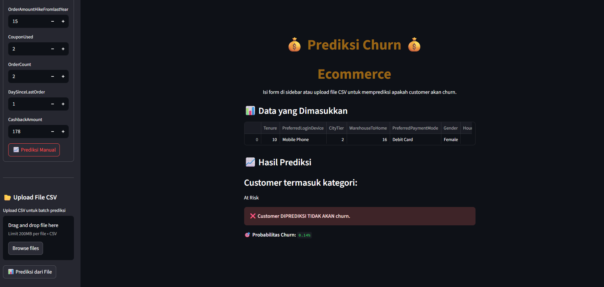
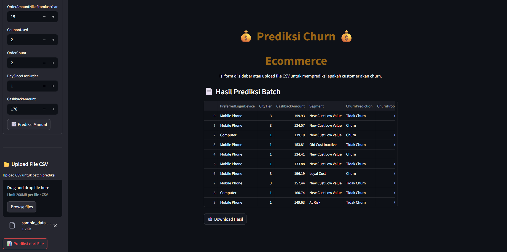
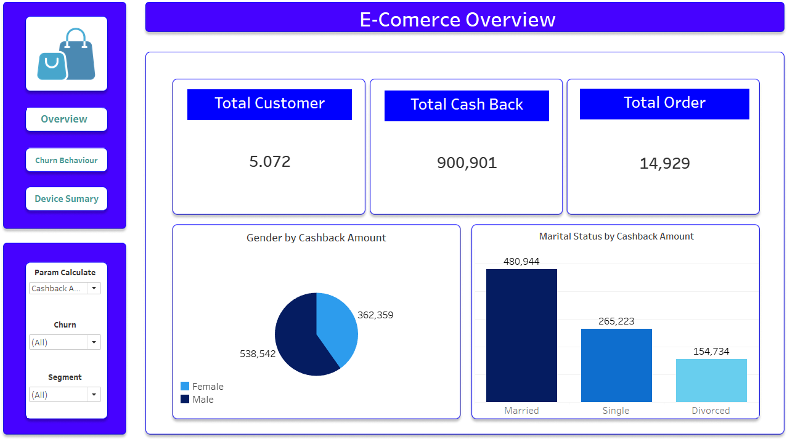
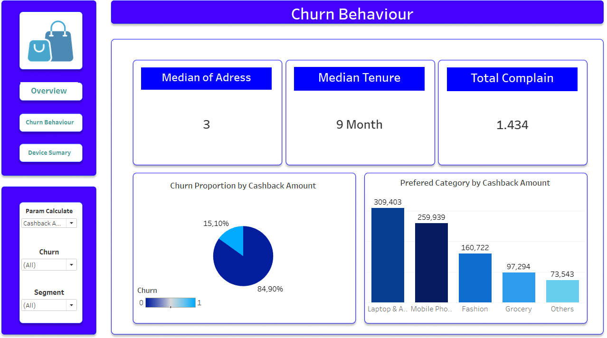
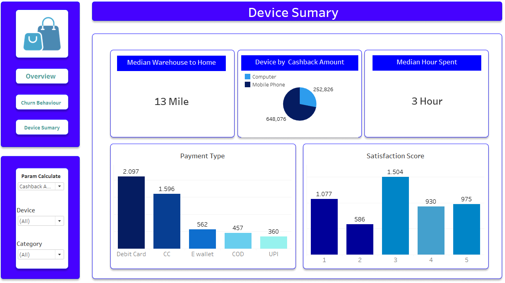

# **Business Problem Understanding**

## **Context**

Perusahaan ini adalah platform e-commerce yang melayani berbagai kategori produk, termasuk fashion, elektronik, dan kebutuhan sehari-hari. Perusahaan telah beroperasi cukup lama dengan basis pelanggan yang besar, sebagaimana tercermin dari data pelanggan yang menunjukkan variasi preferensi kategori belanja serta riwayat penggunaan layanan (tenure). Dalam operasionalnya, perusahaan juga memiliki kebijakan cashback untuk meningkatkan loyalitas pelanggan, serta layanan penanganan komplain untuk menjaga kualitas pelayanan.

Namun, di tengah kompetisi industri e-commerce yang sangat ketat, perusahaan mulai menghadapi tantangan dalam mempertahankan pelanggan. Fenomena *customer churn* (berpindahnya pelanggan ke platform lain) menjadi perhatian utama karena berdampak langsung pada pendapatan dan keberlanjutan bisnis.

Secara umum, ada dua cara untuk mengatasi *customer churn* agar perusahaan tetap menjaga profitabilitas: mempertahankan pelanggan lama (*customer retention*) atau mencari pelanggan baru (*customer acquisition*). Berdasarkan statistik lintas industri, riset menunjukkan bahwa biaya *customer acquisition* rata-rata lima kali lebih besar dibandingkan *customer retention*. ([*Source*](https://www.huify.com/blog/acquisition-vs-retention-customer-lifetime-value))

Contoh aktivitas *customer retention*:
- Biaya kampanye loyalitas
- Diskon khusus pelanggan
- Cashback
- Biaya email/pesan promosi
- Program loyalitas

Sebagai ilustrasi, jika perusahaan mengeluarkan dana $100.000 untuk mempertahankan 1.000 pelanggan lama:
- **Customer Retention Cost:**  
 Retention Cost per Customer = $100.000 / 1.000 = $100per customer

- **Customer Acquisition Cost:**  
 Acquisition Cost per Customer = $100 times 5 = $500 per customer

  ([*Source*](https://www.clv-calculator.com/customer-costs/retention-costs-clv/retention-cost-formula/))

Dengan demikian, diasumsikan bahwa biaya untuk mempertahankan satu pelanggan adalah $100, sedangkan untuk mendapatkan pelanggan baru adalah $500.

---

## **Problem Statement**

Untuk mengatasi *customer churn*, perusahaan perlu:
- Membangun sistem yang dapat mengidentifikasi pelanggan yang berisiko churn secara proaktif.
- Mengetahui faktor-faktor yang paling memengaruhi potensi churn berdasarkan data historis.
- Melakukan segmentasi pelanggan yang berpotensi churn agar strategi pencegahan sesuai dengan karakteristik masing-masing segmen.

---

## **Goal**

Berdasarkan permasalahan tersebut, tujuan dari proyek ini adalah:
- Membangun model *Machine Learning* untuk mengidentifikasi pelanggan yang berpotensi churn.
- Mengidentifikasi fitur-fitur yang paling berpengaruh terhadap churn agar dapat dilakukan tindakan pencegahan yang tepat.
- Melakukan segmentasi pelanggan berisiko churn untuk merancang strategi retensi yang lebih efektif.

---

## **Stakeholders**

Pihak-pihak yang terpengaruh langsung oleh hasil analisis churn dan menggunakan output-nya untuk pengambilan keputusan:
- **Marketing Team**, yang akan merancang promosi dan kampanye retensi.
- **Customer Relationship Management (CRM)**, yang bertanggung jawab menjaga pelanggan tetap aktif dan mengirimkan informasi promosi.

---

## **Analytic Approach**

Langkah-langkah yang akan dilakukan:
- Analisis eksploratif untuk memahami data secara mendalam.
- *Data preprocessing* untuk meningkatkan kualitas input ke model.
- Membangun model klasifikasi terbaik melalui *cross-validation*.
- Melakukan *hyperparameter tuning* untuk memaksimalkan kinerja model.
- Mengidentifikasi fitur-fitur yang paling memengaruhi churn.
- Melakukan segmentasi pelanggan menggunakan metode *clustering*.

---

## **Metric Evaluation**

- **Target:**
  - 0 : Tidak churn / masih menjadi pelanggan aktif
  - 1 : Churn / sudah berhenti menggunakan layanan

- **False Positive (FP):**
  - Model memprediksi pelanggan akan churn padahal sebenarnya tidak.
  - **Risiko bisnis:** Perusahaan mengeluarkan biaya retensi untuk pelanggan yang sebenarnya tetap loyal.
  - **Estimasi kerugian:** $100 per pelanggan.

- **False Negative (FN):**
  - Model memprediksi pelanggan akan tetap, padahal sebenarnya churn.
  - **Risiko bisnis:** Perusahaan gagal mencegah churn dan kehilangan pelanggan bernilai tinggi.
  - **Estimasi kerugian:** $500 per pelanggan.

**Kesimpulan Evaluasi:**  
*False Negative* (FN) berisiko lebih besar karena bisa menyebabkan hilangnya pelanggan loyal yang sebenarnya masih bisa dipertahankan. Namun, *False Positive* (FP) juga perlu dikendalikan agar biaya retensi tidak membengkak. Oleh karena itu, metrik evaluasi yang dipilih adalah **F2-Score**, yang memberi bobot lebih pada *recall* (mengurangi FN) sambil tetap mempertimbangkan *precision* untuk mengontrol FP.

---

# **Data Understanding**

**Deskripsi Kolom**

| Kolom                         | Deskripsi                                                              |
|-------------------------------|------------------------------------------------------------------------|
| CustomerID                    | ID unik pelanggan                                                      |
| Churn                         | Penanda churn                                                          |
| Tenure                        | Lama bergabungnya pelanggan                                            |
| PreferredLoginDevice          | Perangkat login utama pelanggan                                        |
| CityTier                      | Tingkat kota                                                           |
| WarehouseToHome               | Jarak gudang ke rumah pelanggan                                        |
| PreferredPaymentMode          | Metode pembayaran yang sering digunakan                                |
| Gender                        | Jenis kelamin                                                          |
| HourSpendOnApp                | Waktu yang dihabiskan di aplikasi/website (jam)                        |
| NumberOfDeviceRegistered      | Jumlah perangkat yang terdaftar                                        |
| PreferedOrderCat              | Kategori pesanan yang paling sering di bulan terakhir                  |
| SatisfactionScore             | Skor kepuasan pelanggan terhadap layanan                               |
| MaritalStatus                 | Status pernikahan pelanggan                                            |
| NumberOfAddress               | Jumlah alamat yang didaftarkan                                         |
| Complain                      | Pernah mengajukan komplain dalam sebulan terakhir                      |
| OrderAmountHikeFromlastYear   | Persentase kenaikan jumlah pesanan dibandingkan tahun lalu              |
| CouponUsed                    | Jumlah kupon yang digunakan dalam sebulan terakhir                     |
| OrderCount                    | Jumlah pesanan yang dilakukan dalam sebulan terakhir                   |
| DaySinceLastOrder             | Jumlah hari sejak pesanan terakhir                                     |
| CashbackAmount                | Rata-rata cashback dalam sebulan terakhir                             |

---

# **Data Cleaning**
Pada Data Cleaning dilakukan :
- Penghapusan duplikat
- Normalisasi Value
- Melakukan Imputasi pada Cell dengan NaN value menggunakan IterativeImputer

# **Explanatory Data Analysis**
Pada Explanatory Data Analysis dilakukan :
- Melihat Distribusi Data
- Mencari tahu apa saja yang menyebabkan `Churn`
- Mencari tahu pola perilaku Customer yang melakukan `Churn`
- Melihat Importance Feature

# **Kesimpulan**

## **Statistika**

Berdasarkan uji statistik yang telah dilakukan, fitur yang paling memengaruhi churn adalah Tenure, Complain, dan PreferedOrderCat. Terdapat sebanyak 841 customer yang melakukan churn, di mana mayoritas merupakan customer baru dengan tenure 0–1 tahun. Dari total customer yang churn tersebut, sebanyak 449 customer atau sekitar 50% pernah melakukan complain. Mayoritas customer yang melakukan complain ini juga berada pada tenure 0–1 tahun.

Dari sisi preferensi order, sebagian besar customer yang churn berasal dari kategori Mobile Phone, yaitu sekitar 58% dari total churn pada 5 kategori order yang tersedia. Menariknya, Mobile Phone juga merupakan kategori yang paling banyak mendapatkan complain. Dari 449 customer yang churn dan melakukan complain, sekitar 60% melakukan complain terhadap produk Mobile Phone.

## **Cost Marketing**
| Strategi                | Cost Campaign                | Nett Benefit                       |
| ----------------------- | ---------------------------- | ---------------------------------- |
| **Mass Marketing**      | 101.500   | -17.500                 |
| **ML (sebelum tuning)** | 23.900      | 52.600      |
| **ML (setelah tuning)** | 23.100 | 54.900 |
| **ML + Segmentasi**     | 20.070      | 57.930      |

**Insight Utama**
Cost Campaign berkurang drastis:
Dari 101.500 (Mass Marketing) ➜ 20.070 (ML + Segmentasi) ➜ hemat sekitar 80%

Nett Benefit meningkat signifikan:
Dari rugi (-17.500) ➜ untung (57.930) ➜ perbaikan lebih dari 400%

Segmentasi & tuning penting:
Tuning memberi penghematan tambahan 3%+, segmentasi meningkatkan Nett Benefit 5%+ lagi.

Sehingga:
- Gunakan Machine Learning untuk efisiensi biaya & profit maksimal
- Lakukan tuning untuk optimalisasi berkelanjutan
- Targetkan dengan segmentasi pelanggan untuk hasil paling optimal

# **Screenshoot Deploy Streamlit**

Link: (https://gardaecommercechurn.streamlit.app/)
## **Input 1 data**
  
## **Input bulk data**
  

# **Screenshoot Tableau**
## **Dashboard 1**
  
## **Dashboard 2**
  
## **Dashboard 3**

